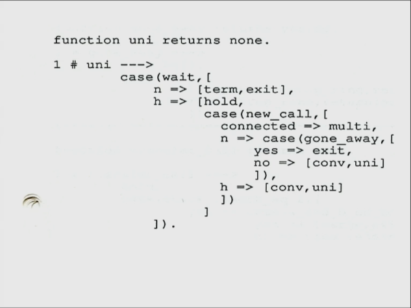

# Implementing Erlang's behaviours without using lightweight processes

The other week I made the
[claim](https://github.com/stevana/armstrong-distributed-systems/blob/main/docs/erlang-is-not-about.md)
that the big idea in Erlang isn't lightweight processes and message passing but
rather its *behaviours*[^1].

In short: Erlang's six behaviours, `gen_server`, `gen_statem`, `gen_event`,
`supervisor`, `application` and `release`, are building blocks for reliable
distributed systems. They abstract away the repetitive, difficult, low-level and
concurrent details, and let the user focus on the semantics of their problem.

In Joe's own words: "Behaviors in Erlang can be thought of as parameterizable
higher-order parallel processes. They represent an extension of conventional
higher-order functions (like map, fold etc) into a concurrent domain."

Many comments, including [one](https://news.ycombinator.com/item?id=34558745)
from Robert Virding[^2], basically claim that one *needs* lightweight processes
and message passing in order to implement behaviours.

Conceptually lightweight processes and message passing came before behaviours,
as Robert points out.

I can imagine that perhaps Erlang's concurrency model makes it easier to
implement behaviours.

But I don't think we can draw the conclusion that they are therefore *needed*
for implementing behaviours (maybe they *were* needed in the special case of how
Erlang evolved, but that's not my point, I'm talking about in *general*).

My intuition is: there are other ways of doing concurrency than lightweight
processes and message passing, a popular one is event-driven programming and
perhaps it make sense to implement behaviours in that setting as well.

My goal isn't to reimplement OTP, merely understand the fundamental ideas behind
behaviours, so that we can build and improve upon them (outside of Erlang/OTP).

I think this is important because the understanding of behaviour isn't well
established, unlike the idea of lightwight process and message passing.

Leading to people stealing lightweight processes and message passing, while
failing to copy behaviours -- which, from my understanding of Joe's thesis, are
the key ingredients in being able to write reliable systems[^3].

## Lightweight processes and message passing

Let's start off by defining what we mean by lightweight processes and message
passing.

To really understand a concept one needs to understand the context in which it
was conceived.

When Joe Armstrong [interviewed](https://youtu.be/fhOHn9TClXY?t=2236) Alan Kay
in 2017, Joe explained how Erlang [came to
be](https://dl.acm.org/doi/10.1145/1238844.1238850).

Joe says in the mid 1980s he was trying to improve the state of [programming
telephony](https://en.wikipedia.org/wiki/Plain_old_telephone_service). This was
before internet, but the telephone system had "services" and "features" so I
suppose in a sense he was interested in improving what what we'd today call
"backend development".

At Ericsson, where he was working, they already had a proprietary programming
language called
[PLEX](https://en.wikipedia.org/wiki/PLEX_(programming_language)) which they
used to program telephony. PLEX, which first appeared in the 70s, and the
telephone hardware switches were a heavy influence on Erlang:

  1. Process and their isolation from each other
  2. Signals and ability to wait for them, i.e. message passing
  3. Hot code swapping

So the early inspiration for Erlang was to be a better version of PLEX and run
on ordinary hardware.

I suppose when Joe was looking around for programming languages that might fit
the bill, he found Alan et al's [Smalltalk](https://en.wikipedia.org/wiki/Smalltalk).

Alan said that the [big
idea](http://lists.squeakfoundation.org/pipermail/squeak-dev/1998-October/017019.html)
in Smalltalk is message passing after all.

Alan, who did a BSc in mathematics and molecular biology, said:

> I thought of objects being like biological cells and/or individual computers
> on a network, only able to communicate with messages (so messaging came at the
> very beginning -- it took a while to see how to do messaging in a programming
> language efficiently enough to be useful).
-- Alan Kay (http://userpage.fu-berlin.de/~ram/pub/pub_jf47ht81Ht/doc_kay_oop_en)

(Smalltalk was also influenced by
[Simula](https://dl.acm.org/doi/abs/10.1145/365813.365819), but I don't know
anything about Simula so I won't go further down the rabbit hole at this point.
I'd like to understand Simula better because apparently it was designed to
enable continuous and discrete-event
[simulation](https://en.wikipedia.org/wiki/Simula#Simulation) which is related
to the kind of
[testing](https://github.com/stevana/property-based-testing-stateful-systems-tutorial)
that I care about.)

The problem was that when Joe was playing around with Smalltalk on his Sun
workstation, and it was so slow that he'd go for a coffee break while it was
garbage collecting.

Joe even ordered the first Tektronix Smalltalk
[Workstation](https://randoc.wordpress.com/2018/07/20/tektronix-smalltalk-workstations-4400-and-4300-series/)
in hope of it making things faster.

Parallel to the Smalltalk experiments Joe was also developing an algebra for
telephony (a domain specific language using mathematical notation).

While Joe was waiting for his Smalltalk machine to arrive, he got chatting with
a guy called Roger Skagervall and showed him his algebra, Roger asked Joe if he
had seen Prolog. Joe had not, so Roger pulled him into his office and showed him
how to implement his algebra in Prolog.

The Smalltalk machine arrived, but Joe didn't even plug it in...

And that's the story of how Erlang started, Joe implemented his ideas on how to
improve PLEX in Prolog.

Kerstin Ödling, one of the first Erlang user, wanted to program the MD110
telephone switch.

She was using fishbone diagrams (finite state machine without cycles) like
these[^0] to describe telephony services (I'm imagining these being something
like telephone APIs):


I suppose they didn't have cycles, if you wanted to "go back" you'd simply hang
up and call again.

Here's the direct translation of her diagram into Joe's telephony algebra
written in Prolog:

Kerstin's fishbone diagram in the Prolog library version of Erlang:



The diagrams describe one "session", there were hundreds of thousands of these
happening in parallel.

These messages are sent between "processes", or lightweight threads (as opposed
to heavyweight OS-level threads). The processes are isolated, in that if one
fails somehow it shouldn't affect the other processes.

Not sharing memory and therefor not be able to corrupt each others memory. This
implies no global variables.

But also not be able to hog all CPU in case the process starts doing something
that takes a very long time or ends up getting stuck in an infinite loop.

That's why Erlang has pre-emptive scheduling, a process will be run until it
gets stuck, waiting for a message or I/O, or it reaches some max running time,
at which point it will be switched out and another process will be allowed to
run. Hence even if a process is stuck in an infinite loop, it will not cause any
other process to be stuck.

Given Erlang's use case at Ericsson, how Ericsson's hardware already had process
isolation, and Joe's background in physics it seems quite natural to opt for the
lightweight process and message passing approach.

Having explained what lightweight processes and message passing is in Erlang,
lets just note that similar concepts in other languages: Scala's Akka, Go
channels, Microsoft's [virtual actors](https://github.com/dotnet/orleans),
["Cloud Haskell"](https://haskell-distributed.github.io/),
[Rust](https://doc.rust-lang.org/book/ch16-02-message-passing.html), the actor
model...

While there are technical differences between all these implementations, for the
purpose of this article we shall group them all together and say that they are
implementations of lightweight processes and message passing.

## Generic server

Now that we know how Erlang got its lightweight processes and message passing,
lets implement behaviours without them.

Let's start with the perhaps most useful worker behaviour, `gen_server`. We said
in the previous post that behaviours are interfaces, so lets define that first.

I'll use pseudo code in order to try to be accessible to the wider community.
This pseudo language might have some features that your favorite language
doesn't have, but don't dispair I'll try to provide workarounds in the
footnotes.

> interface `GenServer` parametrised by the types for *state*, *input* and *output*
> and requiring the functions:
>   * `Step` that takes an *input* and the current *state* and returns the updated
>     *state* and an *output*;
>   * `Init` that returns the initial *state*;
>   * `Terminate` which takes the current *state* and returns nothing.

So the user must implement these three (sequential) functions in order to get a
concurrent server. The concurrent code is written against (or parametrised by)
this interface and will work for any instance of this interface.

Let's implement a counter as an example. The counter has an integer as its state
and it can be incremented, its current value can be read, or it can be reset:

> data type `State` is an `Integer`.
> data type `Input` is an enum with the tags `Increment`, `Read` and `Reset`.

The output of the counter when incrementing and resetting is an acknowledgement
while reading the current value returns an integer.

> data type `Output` is a tagged union[^4] with the tags `Ack` and `Value` where
> `Value` has an `Integer` parameter.

The implementation of the `Step` function is a completely sequential program:

> function `Step` from *input* and *state* is defined by case analysis on *input*:
>   * if `Increment`, then the new state is the old *state* + 1 and the output is `Ack`;
>   * if `Read`, then the new state is the old *state* and the output is `Value` with
>     the old *state* as parameter;
>   * if `Reset`, then check what the current state is: if it's 0 then crash
>     (deliberate bug), otherwise the new state is 0 and the output is `Ack`.

We initialise our counter as follows:

> function `Init` checks if an previous state of the counter has been saved to
> the disk. If that's the case then use the saved value as the intial state
> otherwise start with 0.

Lastly we terminate our counter as follows:

> function `Terminate` takes the current *state* and saves it to disk.

The three functions, `Step`, `Init` and `Terminate`, together implement the
`GenServer` interface.

Using the `Step` function we can define a `Run` function which takes an intial
state and a asequence of `Input`s , it applies the `Step` function to the first
input and the initial state, takes the resulting state and `Step`s the second
input with it and so on, until it reaches the last input then it returns the
`Output`.

Using the `Run` function we can write some unit tests:

> `Run` applied to the inital state `0` and the sequence of `Input`s:
>   * `[Increment, Increment, Read]` should return `Value 2`;
>   * `[Increment, Increment]` should return `Ack`;
>   * `[Increment, Reset, Read]` should return `Value 0`;
>   * `[Reset, Reset, Read]` should crash (because of our deliberate bug in
>     `Step`).

## The concurrent infrastructure for a single generic server

Before we make things more complicated by introducing other behaviours than
`gen_server`, lets see how we can get the concurrent server from merely using
our sequential `GenServer` interface.

Lets introduce a new data type which packs up a few more pieces that we need:

> data type `SomeServer` is a struct with the fields:
>   * `name`   of type `String`;
>   * `server` of type `GenServer` where the type parameters *state*, *input*,
>     and *output* have been existenially quantified[^5];
>   * `state`  of type *state*.
>   * `decode` of partial function type `ByteString` to *input*;
>   * `encode` of function type *output* to `ByteString`.

> function `EventLoop` is parametrised by *someServer* of type `SomeServer` and is
> defined in steps:
>   1. Create a concurrent *queue* of `Event`s;
>   2. Fork off a new worker thread with the *someServer* and the *queue*;
>   3. Start a server with the *queue*.

> data type `Event` is a tagged union with the tags:
>   * `Input` with a `ByteString` parameter and a incoming `Socket` parameter;
>   * `Exit`.

The server accepts new connections concurrently, reads the incoming request as a
`ByteString` and enqueues an `Input` to the concurrent *queue* together with the
`Socket` of the client that made the request.

Have we not just moved the problem of needing lightweight processes from our
`GenServer` implementation to the concurrent `EventLoop`?

Using one lightweight process (or thread) per client is one way of implementing
the concurrent server, but we can also use a small fixed number of (heavyweight
OS-level) threads and a [thread
pool](https://eli.thegreenplace.net/2017/concurrent-servers-part-2-threads/), or
a single thread and do [I/O
multiplexing](https://eli.thegreenplace.net/2017/concurrent-servers-part-3-event-driven/).

The worker thread reads from the *queue*, if it sees an `Input` event it tries
to `decode`s the `ByteString`, if decoding fails we move on, if it succeeds we
feed the *input* to the `Step` function of the server together with the current
`state`. The `state` field gets updated with the new state and the *output* gets
`encode`d into a `BytesString` and sent back to the client via the `Socket`.

* XXX: Example interaction with our gen server
> definition `SomeCounter` ...
> function `Main` ...

Hopefully by now I've managed to convince you that we can, at least, implement
the `gen_server` behaviour without using lightweight processes or message
passing.

* The key idea is that the concurrent queue serialises the concurrent requests,
  so that a single thread can apply the requests one by one in a sequential
  fashion, similar to how we implemented `Run`.

* Already useful: separates concurrent networking code from the sequential
  "business logic"

* event loop (or game loop), event-driven program, reactor pattern are all
  different names for the same well known alternatives to lightweight
  processes/threads

* One write thread, sqlite

* Timeouts, schedule timer event to yourself, event loop takes care of this

* All in-memory, power loss = data loss, command sourcing or [async writing to
  disk](https://github.com/stevana/coroutine-state-machines)

## Supervisor

Next lets have a look at how we can add supervisors.

> data type `Supervisor` is a recursive tagged union with the tags:
>   * `Leaf` with a `SomeServer` parameter (or more generally any worker behaviour);
>   * `Node` with a `RestartStrategy` parameter and a `List` of child
>     `Supervisor`s parameter.

> data type `RestartStrategy` is an enum with the tags `OneForOne` and
> `OneForAll`.

> definition `SupervisorExample` is of type `Supervisor` and is a `Ǹode` with
> the restart strategy `OneForOne` and the children:
>   * `Leaf` with a `SomeCounter`;
>   * `Leaf` with a `SomeCounter`.

```haskell
restart :: Name -> Supervisor -> IO Supervisor
restart _nameOfFailedSM (Worker _) = error "restart: invalid supervisor tree"
restart nameOfFailedSM sup = case restartStrategy nameOfFailedSM sup of
  OneForOne -> do
    ssm' <- restartSM nameOfFailedSM defaultGraceTimeMs (lookupSM nameOfFailedSM sup)
    return (updateSM nameOfFailedSM ssm' sup)
  OneForAll -> do
    mapM_ (\(name, ssm) -> stopSM name defaultGraceTimeMs ssm) sup
    mapM (\(name, ssm) -> startSM name ssm >>= \ssm' ->
                          return (name, ssm'))
```

## The concurrent infrastructure for supervisor trees

> function `EventLoopSup` is parametrised by *sup* of type `Supervisor` and is
> defined in steps:
>   1. Create a concurrent *queue* of `Event`s;
>   2. Fork off a new worker thread with the *sup* and the *queue*;
>   3. Start a server with the *queue*.

The worker thread reads from the *queue*, if it sees an `Input` event it tries
to `decode`s the `ByteString`, if decoding fails we move on, if it succeeds we
feed the *input* to the `Step` function of the server together with the current
`state`. The `state` field gets updated with the new state and the *output* gets
`encode`d into a `BytesString` and sent back to the client via the `Socket`.

* try catch around `Step`


## Generic event manager and performance

* Concurrent queue = [fan-in](https://en.wikipedia.org/wiki/Fan-in)
* Event manager = fan-out

In a [talk](https://youtu.be/OqsAGFExFgQ?t=2532) at Functional Conf 2017, Martin
Thompson said:

> "If there's one thing I'd say to the Erlang folks, it's you got the stuff
> right from a high-level, but you need to invest in your messaging
> infrastructure so it's super fast, super efficient and obeys all the right
> properties to let this stuff work really well."

Who is this guy and why did he say that?

Martin Thompson is perhaps best known for introducing the concept of *mechanical
sympathy* in the context of computers.

The term was originally coined by the racing driver [Jackie "Flying Scot"
Stewart](https://en.wikipedia.org/wiki/Jackie_Stewart), who said:

> You don't have to be an engineer to be be a racing driver, but you do have to
> have Mechanical Sympathy.

What he meant was that understanding how the car works makes you a better
driver. Martin makes the analogous claim that knowing how modern CPUs work will
make you a better programmer.

Martin has given several full talks on the topic, so I'll not attempt to repeat all that here

* short version: cpu caches: temporal, spatial, striding https://youtu.be/fDGWWpHlzvw?t=1264

* queue's don't have mechanical sympathy, another (perhaps better known?)
  Martin, Martin Fowler as
  [written](https://martinfowler.com/articles/lmax.html?ref=wellarchitected#QueuesAndTheirLackOfMechanicalSympathy)
  about this

* LMAX disruptor pipeline

* One worker behaviour per CPU core = parallelism, no copying due to disruptor?

* Built-in support for back-pressure, unlike in Erlang where you can run out of
  memory due to the fact that the mailboxes are
  [unbounded](https://github.com/ferd/pobox)

* Determinstic (unlike lightweight processes, well there's
  [PULSE](http://quviq.com/documentation/pulse/index.html), OCaml's eio and
  Java's project Loom has deterministic scheduling I think)

* gen_event -- pubsub / broadcast

* Multicore OCaml's [eio](https://github.com/ocaml-multicore/eio)
  - determinism
  - io_uring
* TigerBeetleDB's [event loop](https://tigerbeetle.com/blog/a-friendly-abstraction-over-iouring-and-kqueue/)
  - also determinism and io_uring

* What about the original problem of many concurrent state machines?

## Application and release

Recall that an `application` is a `supervisor` tree together with whatever else
the application needs that is not the code itself, e.g. graphical assets,
configuration files, etc.

* Supervisor trees have a start up order.

The final behaviour `release` is one or more `application`s together with a way
of upgrading from the currently running release and a way of rolling back in
case the upgrade fails.

But they do provide structure in areas where most programming languages don't
give you anything: reconfiguration, deployment and upgrades.

Joe has [talked](https://youtu.be/h8nmzPh5Npg?t=960) how modules can evolve over
time, how git is useless... while this isn't part of Erlang's `release`s, it
could still be interesting to ponder.

* release?
  - upgrades
    + versioning messages and always supporting previous version?
  - configuration
  - overcoming "container and yaml hell"?
  - hot code swapping
  - ssh access to remote machines in case of multi node deployment?

The last two behaviours `application` and `release` clearly don't have anything
to do with lightweigt processes and message passing.

* packaging, dependency management, dependency hell, nix...

## Summary and contributing

* Hopefully it's clear by now that `gen_server`, `gen_event` and `supervisor`
  don't *have* to be implemented using lightweight processes and message
  passing.

* In fact implementing it the way outlined above might even have performance
  benefits (benchmarks?)

* Many things missing. Far from reimplementing OTP, but that's not the point. I
  want to understand the ideas behind OTP so that we one day can implement
  something better!

* If one worker behaviour per CPU/core then how does supervision work? Links?

* remote supervisors, how is this implemented in Erlang actually? What happens
  if nodes get partitioned? Heartbeats?

* pre-emptive? Less important when we are not spawning processes left and right?
  One worker per CPU/core.

* Erlang supports upgrading/hot code swapping a behaviour while it's running,
  but what about upgrading clustered Erlang nodes without downtime?


## See also

* [A history of Erlang](https://dl.acm.org/doi/10.1145/1238844.1238850) paper
  and talk (scroll down to "supplemental material") by Joe Armstrong (HOPL III,
  2007);

* [The Execution Model of APZ/PLEX](https://www.es.mdh.se/pdf_publications/663.pdf)

* [The Erlang Runtime System](https://blog.stenmans.org/theBeamBook/) by Erik
  Stenman;

* Alan Kay on Erlang being an [object oriented programming
  language](https://www.quora.com/What-does-Alan-Kay-think-about-Joe-Armstrong-claiming-that-Erlang-might-be-the-only-object-oriented-language-and-also-his-thesis-supervisor-s-claim-that-Erlang-is-extremely-object-oriented);

* Martin Thompson's
  [talk](https://www.infoq.com/presentations/mechanical-sympathy/) on
  *Mechanical Sympathy* (2013);

* [*LMAX - How to Do 100K TPS at Less than 1ms
  Latency*](https://www.infoq.com/presentations/LMAX/) by Martin Thompson (QCon
  2010).

* https://github.com/mitchellh/libxev

* [Welcome to Lord of the io_uring](https://unixism.net/loti/index.html)


[^1]: Technically behaviours are part of the [Open Telecom
    Platform](https://en.wikipedia.org/wiki/Open_Telecom_Platform) (OTP).
    According to
    [Wikipedia](https://en.wikipedia.org/wiki/Erlang_(programming_language))
    "the term Erlang is used interchangeably with Erlang/OTP", so we'll just say
    Erlang.

[^2]: One of the original designers and implementors of Erlang, as well as one
    of the "actors" in [Erlang the
    movie](https://www.youtube.com/watch?v=xrIjfIjssLE).

[^3]: In fact I think many languages and libraries have been blinded by thinking
    that lightweight threads *have* to be part of the solution in order to
    achieve Erlang's robustness.

    The example I'm most familiar with is ["Cloud
    Haskell"](https://hackage.haskell.org/package/distributed-process).

[^4]: Or enums and structs and potentially union types if your language of
    choice doesn't have [sum types](https://en.wikipedia.org/wiki/Tagged_union).

[^5]: If your language of choice doesn't support [existential
    types](https://en.wikipedia.org/wiki/Type_system#Existential_types), then
    you got the choice of being less generic or less well-typed. One way to be
    less generic is to parametrise the supervisor type by the parameters of the
    generic server, but that means that all your generic servers will have to
    have the same parameters. Or you can be less well-typed by removing the
    parameters from `GenServer` and simply use some generic but fixed type, like
    type type of JSON objects.

[^0]: Kerstin's fishbone diagams and Prolog implementation are taken from the
    following [talk](https://vimeo.com/97329186) (18:00) by Joe.
